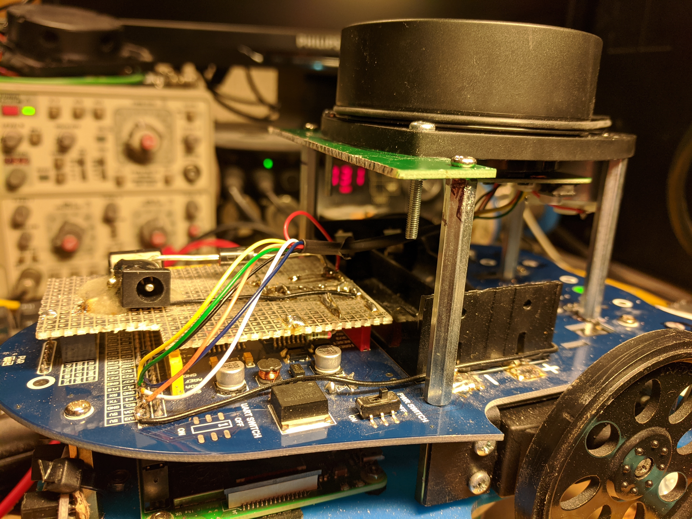
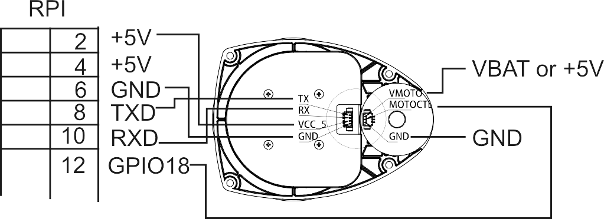
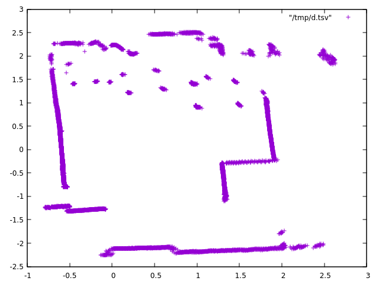

# Slamtec RPLIDAR A1 on an Alphabot with a Raspberry PI



This project describes how to connect a Slamtech RPLIDAR A1 directly
to a Raspberry PI by using its in-built serial port. So no need to use
the supplied USB interface.

This repository contains a C++ class which reads the coordinates
and also does the motor control via PWM of the RPI.

A 360 degree scan is provided by a callback at the sampling rate
of the LIDAR which is kept at 300RPM (5Hz).

## Wiring

There are two sockets on the LIDAR. One is for the serial communication and
the other for the motor control. The serial data is transmitted via the
Raspberry PI serial port and the speed is controlled with GPIO pin 18.

Use the cable which comes with the LIDAR and plug its two plugs into
the two sockets on the LIDAR and chop off the single connector at the other end.

Solder the wires to the serial port of the Raspberry PI
and port 18:



The motor can be receiving the unregulated battery voltage (<10V) or
the 5V from the raspberry PI but the serial interface requires 5V.

# Software

## Prerequisites

Install the pigpio package and development headers:
```
apt-get install libpigpio-dev
```

## Installation

`cmake .`

`make`

`sudo make install`

This installs the library and can then be used in your application.

## Xv11 C++ class

The class has `start()` and `stop()` functions which start and
stop the data acquisition and also start and stop the motor of
the range finder.

The data is transmitted via `DataInterface` where the abstract function
`newScanAvail(XV11Data (&data)[Xv11::nDistance])` needs to be implemented
which then receives both the polar and Cartesian coordinates after
a successful 360 degree scan. Register your `DataInterface` with
`registerInterface`.

## Example program
`printdata` prints tab separated data as
`x <tab> y <tab> r <tab> phi <tab> strength <tab> too_close` until a key is pressed.

Pipe the data into a textfile and plot it with `gnuplot`:
```
sudo ./printdata > tt2.tsv
gnuplot> plot "tt2.tsv"
```


## Credits

The `rplidarsdk` folder is the `sdk` folder
from the official Slamtec git (latest v1.x):

https://github.com/Slamtec/rplidar_sdk
